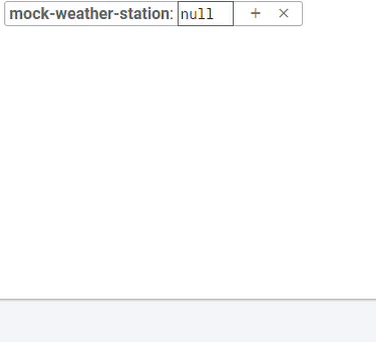
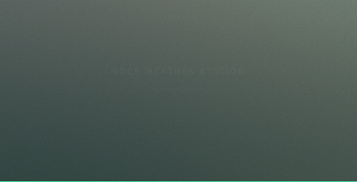

# NodeMCU-based Mock Weather Station
A NodeMCU and DHT11 based weather station that stores readings in a Firebase real time database and is coupled with a website that visualizes said data.


Special Thanks to HTML5 UP for the really cool looking site template that i have used to build the site!


Check [mockweatherstation.tk](https://mockweatherstation.tk/) to see the final result!

## Concept

The mini-project as a whole was an excuse for me to make an IoT project and have it visualize sensor data (Humidity and Temperature in this case) in a website that is accessible from anywhere in the world. A NodeMCU microcontroller with an ESP8266 WiFi module is used to collect data from a DHT11 sensor and save said data in a firebase real-time database. From there, a website (also hosted in firebase) with my own custom domain name access the real-time database and visualizes the data in an interactive plot. Said plot can also be set to only show a specific amount of data points. A table at the bottom of the page also shows the current sesonr measurment and some quick statistical data of the set (average, maximum heat and temperature with their time stamps). For testing purposes, the sensor pushes a data reading every 10 seconds, this can be easily changed to any other value as needed.

## Used NodeMCU Libraries

For the Arduino sketch, I have used the ```DHTesp``` and ```FirebaseESP8266``` libraries since they were the only ones that I could get working. I have also used ```WiFiUdp``` to generate the Unix time stamps used for plotting purposes. A more robust and future proof method of time stamping would be using firebase cloud functions to auto generate stamps from the cloud size. This will drop consumption from the NodeMCU side but I am still a newbie to the whole thing so I just went with this solution instead.

## NodeMCU Code

The code is pretty straight forward. Connect to my local WiFi network, use NTP thorugh a UDP connection to get time remotly and generate unix time stamps (with a 4 hour shift to acomodate for my time zone), and connect to my project's firebase database. Every **10 seocnds**, the system will read sensor data and add it to a ```FirebaseJson``` object that has the ```Humidity```, ```Temperature```, and ```Time``` values saved up before pushing to the database. Individual values for the current humidity and temperature are also sent for the purpose of showing them in real time as a text box in the website. The following is a GIF showing how the structured data is sent to the databse.


## Website

Full disclosure, I have used [this neat template](https://html5up.net/overflow) from HTML5 UP as the basis of the site; I think it looks pretty cool! The main JS codes are the ```plot.js``` and ```realtime.js``` files that are responsible for plotting the data from firebase through **Plotly.JS**, showing the current measurment, and do some quick statsitical calculations. The website is also hosted on firebase and I have set up a custom ```.tk``` domain so that I can use a neat short name for the URL. Here is a GIF showing the user interface of the site:


## Conclusion

This was a rather fun project! It was my first time dealing with firebase hosting and databases, as well as using JavaScript and custom domain names. I appreciate web devs even more now and understand how bothersome such design process can get!
